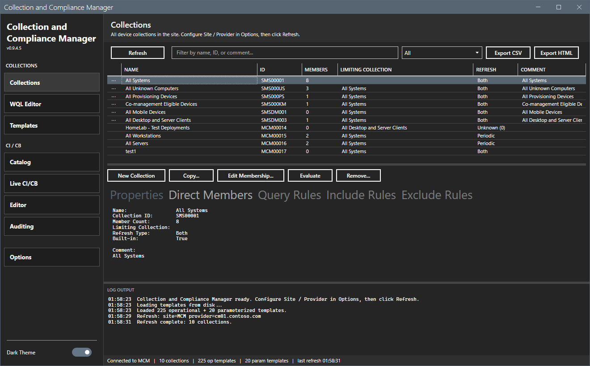
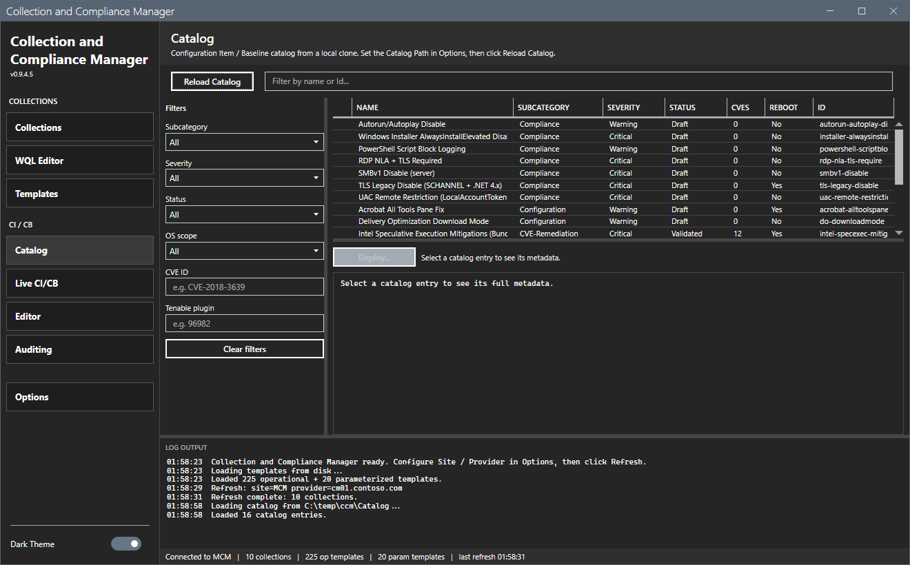

# Collection and Compliance Manager

A MahApps.Metro WPF GUI for managing MECM (Configuration Manager) device collections, WQL rules, and compliance configuration items / baselines. Skip the slow console -- load collections into a local grid, edit WQL in a fast monospace editor, browse and deploy a catalog of pre-made CI/CB hardening baselines, edit live compliance settings, and audit drift.

Ships with a template library (225 operational queries + 20 parameterized WQL templates) and a bundled CI/CB catalog of 16 ready-made hardening / compliance baselines.



## Requirements

- Windows 10 / 11
- PowerShell 5.1
- .NET Framework 4.7.2+
- Configuration Manager console installed (provides the `ConfigurationManager` PowerShell module)

## Quick Start

1. Right-click `start-ccm.ps1` -> **Run with PowerShell**, or from a PowerShell prompt:

   ```powershell
   powershell -ExecutionPolicy Bypass -File start-ccm.ps1
   ```
2. Click the **Options** button on the sidebar and set your Site Code and SMS Provider.
3. Click **Refresh** to load every device collection.

## Layout

The shell uses a sidebar layout with seven views and an Options modal, grouped into **Collections** and **CI / CB**:

- **Collections** -- master-detail grid of every device collection: Name, ID, Member Count, Limiting Collection, Refresh Type, Comment. Detail panel tabs: Properties, Direct Members, Query Rules, Include Rules, Exclude Rules. Filter by membership shape or free text.
- **WQL Editor** -- pick a collection and rule, edit the WQL in the monospace editor, **Validate Query** (syntax-check via `Invoke-CMWmiQuery`), **Preview Results** (match count). Add, Update, or Remove rules.
- **Templates** -- Operational + Parameterized tabs. Pick a template, fill parameters live, then **Copy to WQL Editor** or **Apply to Collection**.
- **Catalog** -- browse the bundled CI/CB catalog (`.\Catalog`); filter by subcategory / OS / CVE / Tenable plugin; deploy an entry (renders a form from its metadata, checks dependencies, confirms, runs the builder, and tags the baseline `[ccm:<id>@<version>]`).
- **Live CI/CB** -- the configuration items and baselines on the connected site. CI grid (Name, Version, In Baseline, # Settings, Modified). CB grid (Name, Compliant / Non-Compliant / Targeted, # Deployments, ccm tag). Select a baseline to see its per-collection deployments (counts + Enforcement) and bulk-act: Enable/Disable Remediation, Redeploy, Reassign, Delete.
- **Editor** -- pick a CI, view its settings, and Add / Edit / Remove registry or script compliance settings. Edit pre-fills current values (script body + language) and applies only what you change.
- **Auditing** -- Drift tab (deployed baseline version vs. catalog) and Compliance tab (per-collection compliance summary + evaluation freshness); export either to CSV.

## Workflows

### Create or copy a collection

1. **Collections** view -> **New Collection**. Pick name, limiting collection, comment, refresh type. Click Create.
2. To clone an existing one: select the source row, click **Copy...**, name the clone, click Copy.

### Edit direct membership

1. Select a collection on the **Collections** view.
2. Click **Edit Membership...** to open the modal: add devices by name (auto-resolves Resource ID), remove selected members in bulk with confirmation.

### Author a new WQL rule

1. Switch to **WQL Editor** view.
2. Pick a target collection.
3. Type or paste the WQL. Click **Validate Query** to syntax-check.
4. Click **Preview Results** to count matches.
5. Type a rule name and click **Add Rule**.

### Apply a ready-made template

1. Switch to **Templates** view -> **Operational** tab.
2. Pick a template (e.g., "Workstations | Windows 11 24H2"). The expanded WQL appears in the right pane.
3. Click **Apply to Collection...**, pick a target, confirm the rule name, click Apply.

### Use a parameterized template

1. **Templates** view -> **Parameterized** tab.
2. Pick a template (e.g., "Software Installed by Name").
3. Fill in the parameters (e.g., SoftwareName = `7-Zip`). The expanded WQL updates live.
4. **Apply to Collection...** or **Copy to WQL Editor** for further tuning.

## Template Categories

**Operational**: Clients, Clients Version, Hardware Inventory, Laptops, Microsoft 365 Apps Build Version / Channel, Mobile Devices, Office 365 Build / Channel (legacy), Project, SCCM Infrastructure, Servers, Software Inventory, System Health, Systems, Visio, Windows Update Agent, Workstations.

**Parameterized**: Software (Installed / Not Installed by Name, Version), OS Build, Client Version, Manufacturer, Model, HW / SW Inventory Reporting, AD OU, Created Within N Days, Chassis Type, TPM, Disk Space, RAM, IP Subnet, Domain, BIOS Version, BitLocker, Last Boot.

## Bundled CI/CB Catalog

Ships under `Catalog/` (auto-loaded). Each entry is a `metadata.psd1` + builder that creates the named Configuration Item(s) and Baseline(s) on your site. † = reboot required.



**Compliance**
- **Autorun/Autoplay Disable** — `NoDriveTypeAutoRun = 255`; kills removable-media / mapped-share autorun.
- **PowerShell Script Block Logging** — `EnableScriptBlockLogging = 1` (event 4104); detective control.
- **RDP NLA + TLS Required** — `UserAuthentication = 1`, `SecurityLayer = 2`; removes pre-auth RDP surface.
- **SMBv1 Disable (server)** — `LanmanServer\SMB1 = 0`.
- **TLS Legacy Disable (SCHANNEL + .NET 4.x)** † — disables SSL 2/3, TLS 1.0/1.1, enables TLS 1.2, forces .NET 4.x strong crypto (24 DWORDs).
- **UAC Remote Restriction** — `LocalAccountTokenFilterPolicy = 0`; blocks Pass-the-Hash lateral movement.
- **Windows Installer AlwaysInstallElevated Disable** — `HKLM = 0`; removes an MSI→SYSTEM LPE primitive.

**Configuration**
- **Acrobat All Tools Pane Fix** † — Adobe workaround (`bGenCoverPagesLabelStrings = 1`); retire when patched.
- **Delivery Optimization Download Mode** — `DODownloadMode` (clients = 0, servers = 99); one CI/CB per OS class.

**CVE-Remediation**
- **CPU Speculative Execution Mitigations (Intel + AMD, Bundled)** † — bitmask enforcement of `FeatureSettingsOverride`; vendor auto-detected, one CI/CB per Hyper-Threading variant. Covers Spectre/Meltdown/SSBD/L1TF/MDS/TAA/SRBDS, Intel BHI, AMD BTC + Inception.

**Hardening**
- **Anonymous Enumeration Restrictions** — `RestrictAnonymous`/`RestrictAnonymousSAM = 1`, `EveryoneIncludesAnonymous = 0`.
- **LLMNR Disable** — blocks Responder-style name-resolution poisoning.
- **LSA Protection (RunAsPPL)** † — `RunAsPPL = 1`; LSASS as PPL, blocks most credential dumping.
- **NTLM LmCompatibilityLevel** — `= 5` (NTLMv2-only; refuse LM & NTLMv1).
- **SMB Signing Required** — `RequireSecuritySignature = 1` (client + server); defeats SMB relay.
- **WDigest Credential Caching Disable** — `UseLogonCredential = 0`; blocks Mimikatz wdigest cleartext recovery.

## Project Structure

```
collection-and-compliance-manager/
+- start-ccm.ps1                             # WPF shell
+- MainWindow.xaml                           # Main window layout
+- Lib/                                      # Vendored MahApps.Metro 2.4.10
+- Module/
|  +- CCMCommon.psd1                         # Module manifest
|  \- CCMCommon.psm1                         # Business logic (53 functions)
+- Templates/
|  +- operational-collections.json           # 225 ready-made queries
|  \- parameterized-templates.json           # 20 parameterized templates
+- Catalog/                                  # Bundled CI/CB catalog (16 entries: metadata.psd1 + builder)
|  +- Compliance/  +- Configuration/  +- CVE-Remediation/  \- Hardening/
+- docs/                                     # CATALOG-SCHEMA.md (catalog metadata contract)
+- CHANGELOG.md
+- LICENSE
\- README.md
```

## Safety

- Built-in collections (SMS prefix) cannot be deleted.
- Confirmation dialogs before every destructive operation (collection removal, member removal, query-rule removal).
- WQL validation before applying query rules.
- Lazy loading of direct members keeps refreshes bounded for large environments.

## License

This project is licensed under the [MIT License](LICENSE).

## Author

Jason Ulbright

## Credits

Ready-made operational collection queries adapted from [SystemCenterDudes](https://www.systemcenterdudes.com/create-operational-sccm-collection-using-powershell-script/) / [prae1809/PowerShell-Scripts](https://github.com/prae1809/PowerShell-Scripts/tree/master/OperationalCollections).
